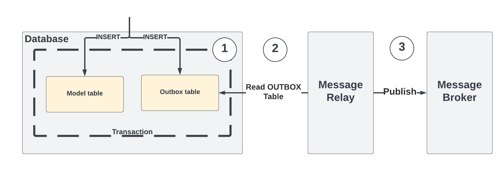

# Active Outbox
A Transactional Outbox implementation for Rails and ActiveRecord.



This gem aims to implement the event persistance side of the pattern, focusing only on providing a seamless way to store Outbox records whenever a change occurs on a given model (#1 in the diagram).
We do not provide an event publisher, nor a consumer as a part of this gem since the idea is to keep it as light weight as possible.

## Motivation
If you find yourself repeatedly defining a transaction block every time you need to persist an event, it might be a sign that something needs improvement. We believe that adopting a pattern should enhance your workflow, not hinder it. Creating, updating or destroying a record should remain a familiar and smooth process.

Our primary objective is to ensure a seamless experience without imposing our own opinions or previous experiences. That's why this gem exclusively focuses on persisting records. We leave the other aspects of the pattern entirely open for your customization. You can emit these events using Sidekiq jobs, or explore more sophisticated solutions like Kafka Connect.

## Why active_outbox?
- Seamless integration with ActiveRecord
- CRUD events out of the box
- Ability to set custom events
- Test helpers to easily check Outbox records are being created correctly
- Customizable

## Installation

Add this line to your application's Gemfile:

```ruby
gem 'active_outbox'
```

And then execute:
```bash
bundle install
```
Or install it yourself as:
```bash
gem install active_outbox
```

## Usage
### Setup
Create an initializer under `config/initializers/active_outbox.rb` and setup the default outbox class to the `Outbox` model you will create in the next step.
```bash
rails g active_outbox:install
```
After creating the initializer, create an `Outbox` table using the provided generator and corresponding model. Any model name can be passed as an argument but if empty it will default to just `outboxes`. The generated table name will be `model_name_outboxes`.
```bash
rails g active_outbox:model <optional model_name>
```

To allow models to store Outbox records on changes, you will have to include the `Outboxable` concern.
```ruby
# app/models/user.rb

class User < ApplicationRecord
  include ActiveOutbox::Outboxable
end
```
### Base Events
Using the User model as an example, the default event names provided are:
- USER_CREATED
- USER_UPDATED
- USER_DESTROYED

### Custom Events
If you want to persist a custom event other than the provided base events, you can do so.
```ruby
user.save(outbox_event: 'YOUR_CUSTOM_EVENT')
```
## Advanced Usage
### Supporting UUIDs
By default our Outbox migration has an `aggregate_identifier` field which serves the purpose of identifying which record was involved in the event emission. We default to integer IDs, but if you're using UUIDs as a primary key for your records you have to adjust the migrations accordingly. To do so just run the model generator with the `--uuid` flag.
```bash
rails g active_outbox:model <optional model_name> --uuid
```
### Multiple Outbox mappings
If more granularity is desired multiple `Outbox` classes can be configured. After creating the needed `Outbox` classes for each module you can specify multiple mappings in the initializer.
```ruby
# frozen_string_literal: true

Rails.application.reloader.to_prepare do
  ActiveOutbox.configure do |config|
    config.outbox_mapping = {
      'member' => 'Member::Outbox',
      'user_access' => 'UserAccess::Outbox'
    }
  end
end
```
## Contributing

Bug reports and pull requests are welcome on GitHub at https://github.com/rootstrap/active_outbox. This project is intended to be a safe, welcoming space for collaboration, and contributors are expected to adhere to the [code of conduct](https://github.com/rootstrap/active_outbox/blob/main/CODE_OF_CONDUCT.md).

## License

The gem is available as open source under the terms of the [MIT License](https://opensource.org/license/mit/).

## Code of Conduct

Everyone interacting in the ActiveOutbox project's codebases, issue trackers, chat rooms and mailing lists is expected to follow the [code of conduct](https://github.com/rootstrap/active_outbox/blob/main/CODE_OF_CONDUCT.md).
